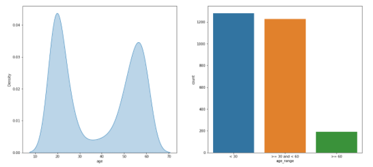

# Image Classification 대회

### EDA (Exploratory Data Analysis)
- 수집한 데이터가 들어왔을 때, 이를 다양한 각도에서 관찰하고 이해하는 과정이다. 한마디로 데이터를 분석하기 전에 그래프나 통계적인 방법으로 자료를 직관적으로 바라보는 과정. 

- 데이터를 분석한 결과 다음과 같은 주요 문제점을 발견할 수 있었습니다.
    - 특정 연령대의 데이터가 부족함
    - 사진의 경우 마스크를 쓴 사진이 5장으로 다른 case에 비하여 많음
    - 일부 데이터의 경우 잘못된 라벨링이 되어 있음

### 데이터 불균형 이슈에 따른 해결방안
    1. 데이터 셋에서 마스크 사진을 2가지만 추출
    2. 데이터 셋 나이 수정을 통한 데이터 불균형 최소화
    3. Stratified K-Fold

- 위와 같은 문제점을 해결 하기 위하여 몇 가지 방안을 모색하였습니다. 우선 구성할 데이터 셋에서 마스크 사진은 2장만 고르기로 하였습니다. 즉, 마스크 : 마스크 오착용 : 마스크 미착용 = 2 : 1 : 1의 비율이 되도록 구성하기로 했습니다. 실제로도 실험결과 마스크 사진을 전부 넣는 것 보다는 적절한 비율로 넣어 데이터셋을 구성하는 것이 성능이 좋게 나와 최종적으로 이 방안으로 결정하게 되었습니다. 잘못된 라벨링 데이터에 대해서는 고민 하였으나, 토론 게시판에서 타 캠퍼분이 작성하신 글의 도움을 받아 수정할 수 있었습니다. 전수조사를 통해 찾아내셨다고 했는데, 이 자리를 빌어 다시한번 감사를 전합니다. 
- 가장 난관은 바로 **연령대의 불균형**이었습니다. 실제로도 모델의 수행 결과를 Tensorboard로 살펴본 결과, 연령대를 잘 맞추지 못 함을 알 수 있었고, 이를 해결하기위해 몇가지 의견을 모을 수 있었습니다. 첫번째로는 58, 59세를 60세 이상으로 편입시켜 보는 방법이었고, 두번째는 Image Blending으로 데이터의 양을 불려보는 방법이었습니다. 실험결과 Image Blending을 한 경우 오히려 성능이 떨어지게 되어서 58, 59세를 60세 이상으로 편입시키는 방식을 사용하기로 하였습니다. 그 외에도 Oversampling과 Weighted random sampling 같은 샘플링 기법 및 Ensemble model 적용을 결정하였습니다.
- Stratified K-Fold 를 사용하여 target에 속성 값의 개수를 동일하게 가져감으로써 데이터가 몰리는 것을 방지하였다

### 시도해본 것
1. **Data Augmentation** 을 통한 oversampling, undersampling
2. **Weighted Random Sampling** - Batch에 항상 균일한 분포가 들어오도록 하는 기법
3. **Weighted Loss Function** - Label의 개수가 많은 것의 Loss는 적게주고, 개수가 적은 것에 대해서는 Loss를 크게 주는 기법

### Code
    001_DataAnalysis => Exploratory Data Analysis
    002_DataAugmentation => Data Augmentation 할 떄 사용한 파일
    003_wideResnet50Model => 첫번째 성능 좋았던 모델
    