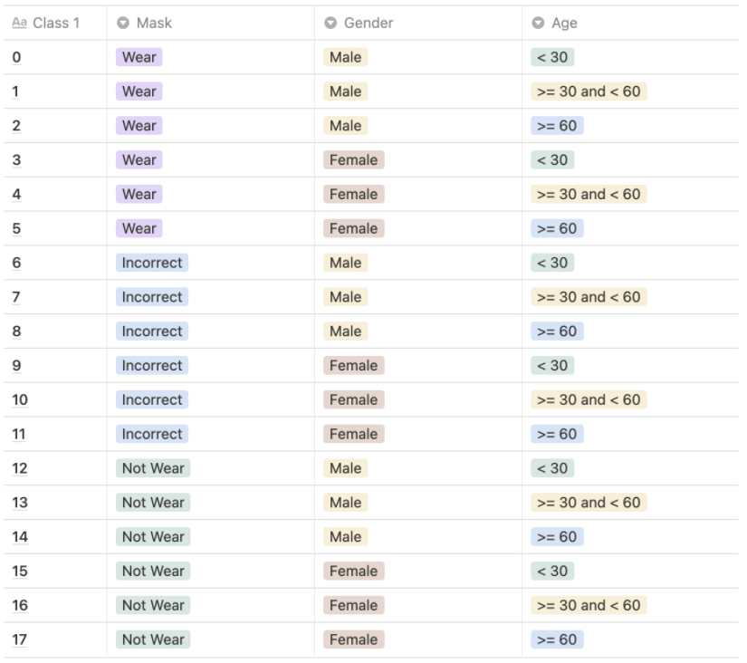
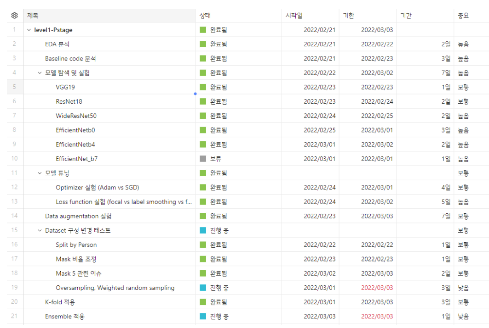
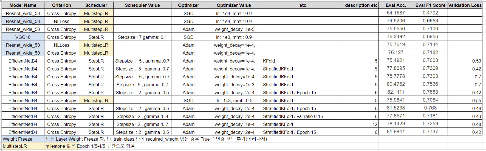

##  :penguin: 자, 연어 한접시's First P-Stage Project :penguin:
부스트 캠프 AI Tech 3기 12조의 마스크 착용 상태 분류 프로젝트

## :mag_right: Overview
### Background
> COVID-19의 확산으로 우리나라는 물론 전 세계 사람들은 경제적, 생산적인 활동에 제약을 받게 되었다. 
> 이번 프로젝트는 사진 속 사람의 특징에 따라 분류를 해야하는 Image Classification Task에 속한다
> 단순하게 마스크 착용 여부만 판단하는 것이 아니라, 잘못 착용한 경우(코스크, 턱스크 등등) 도 같이 분류해야 한다.
> 추가적으로 성별과 연령대(30대 이하, 30~60, 60대 이상)도 올바르게 분류할 수 있어야 한다.

### Problem definition
> (384, 512) 사람 이미지가 주어지면 나이, 성별, 마스크 착용 여부에 따라 18개의 클래스로 Classification 하는 모델 구현
<p align="center"> 
    
</p>

### Development Environment
    개발 환경(Hardware) : aistage에서 제공하는 서버 및 GPU(Tesla V100)
    개발 환경(IDE) : Jupyter notebook, VSCode, PyCharm 등
    협업 및 기타 Tool : Github, Notion, Zoom, TensorBoard, wandb

### Project Development Process
<p align="center"> 
    
</p>

#### Model Summary
- 처음에는 VGG19와 Resnet18, Resnet50을 사용하였으나, 더 높은 성능을 위해 최종적으로는 EfficientNet-b4를 사용하게 되었다

#### Model Selection and Analysis
<p align="center"> 
    
</p>

#### Model Evaluation and Improvements
- 이미지를 학습시키고 inference 과정을 거칠 때 이미지의 크기에 따라 속도가 차이가 있음을 알게 되었습니다. 이미지를 CenterCrop을 사용해 가장자리 일부분을 자라내고 resize과정을 통해 crop된 이미지 사이즈의 80% 크기를 줄여 학습/확인 과정을 거쳤습니다.

- 이미지 학습 시 데이터에 noise를 주는 것이 학습에 효과적일 것이라고 생각했습니다. Horizontal Flip, ColorJitter, Random Brightness 등 여러 Augmentation을 활용하여 Over Sampling과 Under Sampling 등을 시도하였으나 오히려 성능이 낮아지는 것을 확인할 수 있었습니다. 최종 제출 모델에서 모델에서 가장 기본적인 Augmentation을 적용함으로써 0.04 정도의 성능 향상을 이루었습니다.

- 모델의 학습 과정을 살펴본 결과 Mask와 Gender 판별에는 큰 문제가 없었으나, Age를 판단하는 과정에서 이슈가 있었습니다. 특정 연령대의 데이터 불균형을 원인으로 판단하였습니다. 최종적으로 나이에 대한 기준을 다르게 두어서 특정 연령대의 데이터 불균형 이슈를 조금은 완화 시킬 수 있었습니다. 

### Project Tree
```bash
level1-image-classification-level1-nlp-12
├── EDA
│   ├── 001_DataAnalysis.ipynb
│   ├── 002_DataAugmentation.ipynb
│   ├── 003_wideResnet50Model.ipynb
│   └── README.md
├── README.md
├── dataset.py
├── inference.py
├── loss.py
├── model.py
├── project_tree.txt
├── requirments.txt
└── train.py
```

## :page_facing_up: Wrap Up Report
[Wrap Up Report](./material/WrapUp%20%EB%A6%AC%ED%8F%AC%ED%8A%B8.pdf)